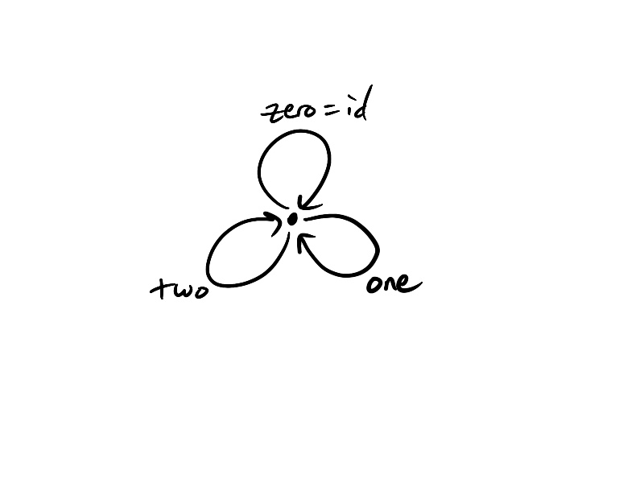

We can view addition modulo 3 as a monoid category: we have a single object 
and three morphisms called `zero`, `one`, and `two`. 

We define composition as follows, taking `zero` to be the identity morphism:
1. zero &compfn; zero = zero
2. zero &compfn; one = one &compfn; zero = one
3. zero &compfn; two = two &compfn; zero = two
4. one &compfn; two = two &compfn; one = zero
5. one &compfn; one = two
6. two &compfn; two = one

