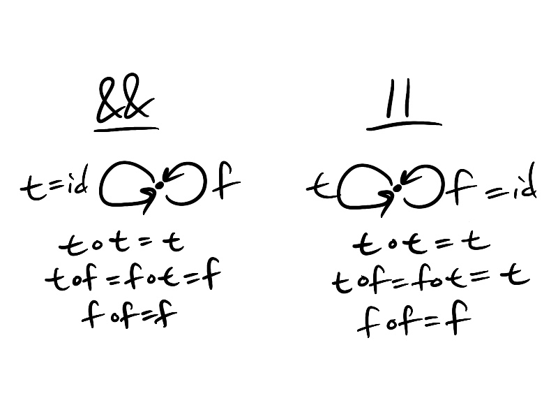

From Bool we can obtain two monoids corresponding to && (AND) and || (OR). We get && if we take True to be the identity element,
and we get || if we take False to be the identity element:

## &&

True && True = True

True && False = False && True = False

False && False = False

We also have associativity (x && y) && z = x && (y && z).

## ||

True || True = True

True || False = False || True = True

False || False = False

We also have associativity (x || y) || z = x || (y || z).

## As categories
We can view the monoids && and || as categories:

