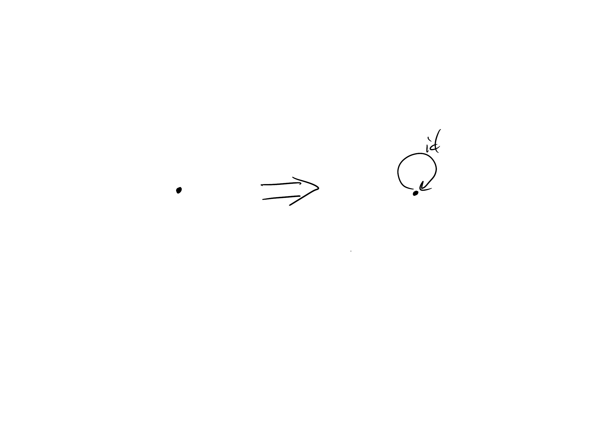
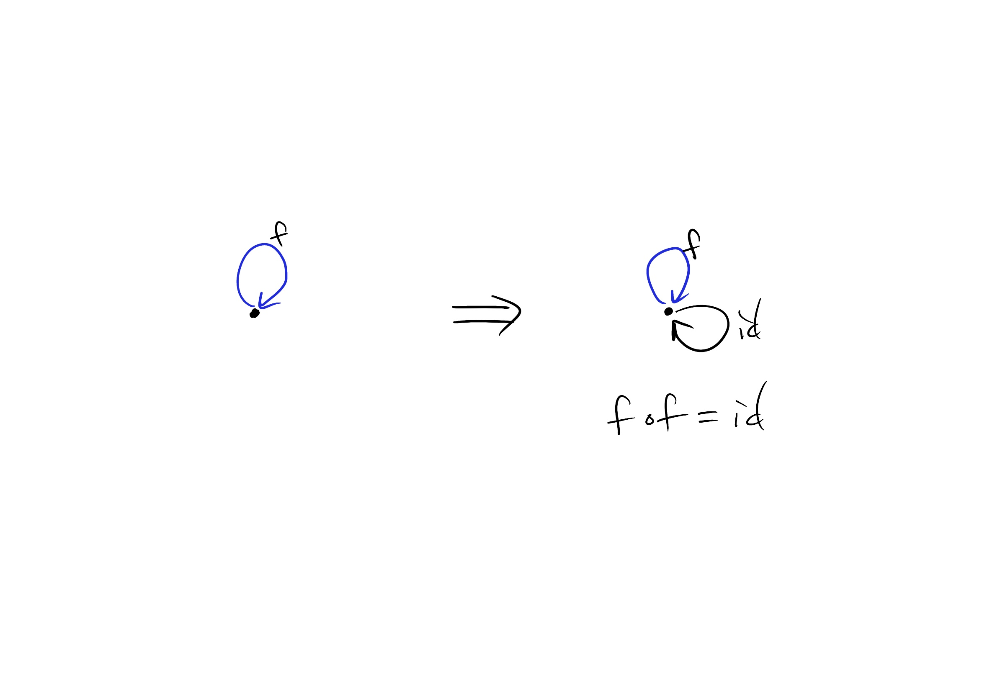
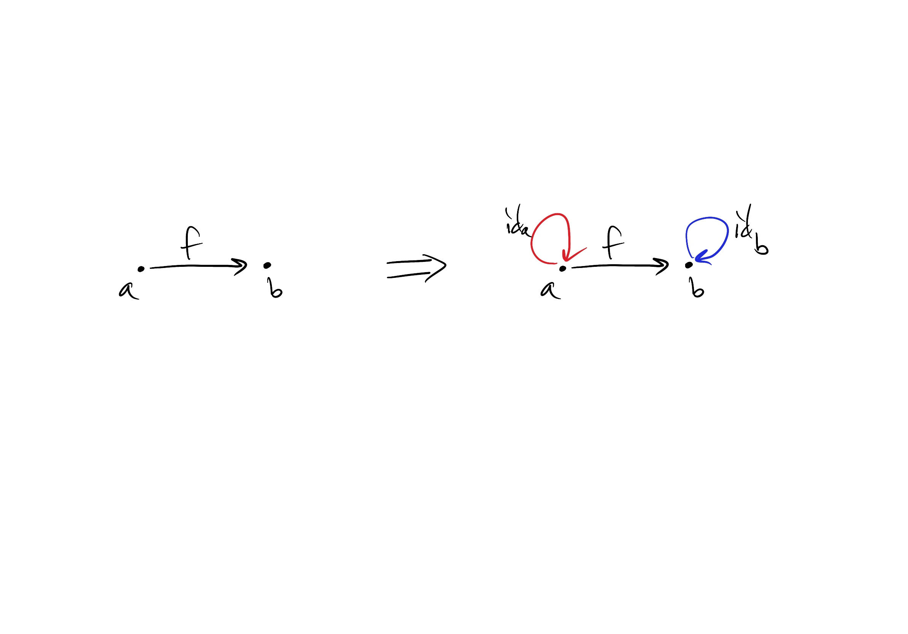

1. A graph with one node and no edges
  

1. A graph with one node and one edge
  

1. A graph with two nodes and a single arrow between them
  

1. A graph with a single node and 26 arrows marked with the
letters of the alphabet: a, b, c ... z: 

This generates a category isomorphic (equivalent) to the monoid consisting of all strings of the form `"abc"`, `"abapfz"`, etc. The identity element is given by the empty string `""`.